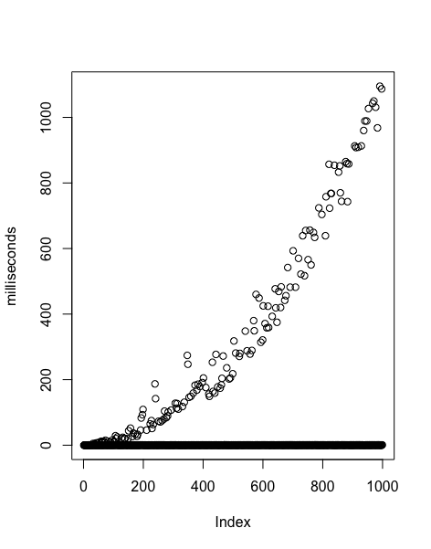
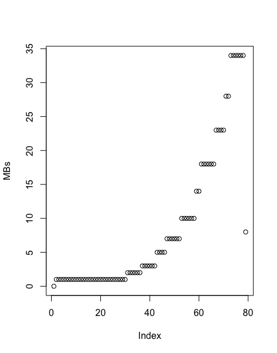

# Factorize-it –toteutusdokumentti

# Toteutusdokumentti

Ohjelman yleisrakenne
Saavutetut aika- ja tilavaativuudet (m.m. O-analyysit pseudokoodista)
Suorituskyky- ja O-analyysivertailu (mikäli työ vertailupainotteinen)
Työn mahdolliset puutteet ja parannusehdotukset
Lähteet

## Ohjelman yleisrakenne

Ohjelman tarkoitus on antaa käyttäjälle mahdollisuus testata, onko jokin kokonaisluku alkuluku. Luokkia on tällä hetkellä kaksi pääasiallista: PrimeTools ja Polynomial.

PrimeTools-luokka pitää sisällään lukuteoreettiset työkalut, joilla alkeellisuutta testataan. Ohjelman aikana käyttäjä tarvitsee vain yhden PrimeTools-olion käyttöönsä. Metodeista tärkein on aksPrimalityTest, joka on toteutus nopeasta AKS-testistä potentiaalisille alkuluvuille. Tätä metodia avustamaan on toteutettu joukko apumetodeita, joita tarvitaan algoritmia ajaessa. Näihin kuuluvat suurimman yhteisen tekijän määrittävä gcd-metodi, suhteellista alkeellisuutta testaava areCoprime-metodi sekä modulaarisesta eksponentiaatiosta vastaava modularExponentiation-metodi.

Polynomial-luokan oliot ovat yhden muuttujan kokonaislukukertoimisia polynomeja. Luokkaa tarvitaan AKS-algoritmin viimeiseen ja tärkeimpään vaiheeseen, jossa lasketaan modulaariaritmetiikkaa tietyillä polynomeilla. Tätä varten luokkaan on toteutettu joukko polynomien algebraan liittyviä metodeja. Polynomial-luokan olioilla on kaksi attribuuttia: kertoimet määrittävä, long[]-tyyppinen coefficients" sekä polynomin asteen säilövä "degree".

Ohjelmaa käytetään graafisen käyttöliittymän kanssa. Käyttöliittymästä vastaavat luokat
sisältyvät

## Aikavaativuus

Ideaalitapauksessa algoritmin aikavaativuuden tulisi olla luokkaa O(log(n)^6*log^6(log(n)^6)).

Tämän toteutuksen kohdalla näyttää siltä, että aikavaativuutta ei ole saavutettu.
Kuvaajan 1 perusteella näyttäisi pikemminkin, että alkulukujen kohdalla
aikavaativuus kasvaa eksponentiaalisesti syötteen kasvaessa, mikä johtuu
Polynomial-luokan metodien hitaudesta. Melkein pelkästään sellaisissa tapauksissa, että
tarkasteltava luku n on alkuluku, käytetään Polynomial-luokkaa, joten alkuluvut
erottuvat kuvaajassa ajallisesti selvästi vaativampina kohteina. Yhdistettyjen
lukujen kohdalla algoritmi toimii huomattavasti nopeammin.

Näyttäisi siltä, että aikavaativuus on alkulukujen tapauksessa, eli huonoimmassa mahdollisessa
tilanteessa, luokkaa O(sqrt(phi(n))log(n) * n^4). Tämä johtuu siitä, että polynomikongruenssin testaaminen
tässä toteutuksessa käyttää apunaan polynomien kertomista ja potenssiin korottamista.
Polynomien keskenään kertominen on aikavaativuudeltaan O(n^2), sillä en ole lähtenyt
toteuttamaan nopeaa Fourier'n muunnosta osaksi projektiani. Mikäli olisi ollut enemmän aikaa,
olisin yrittänyt. Toisaalta ylivuoto-ongelmien takia jokainen eksponentiaatiokerta käyttää
aikaa lopputulospolynomin kerrointen jakojäännösten laskemiseen mod(n)-metodia käyttäen,
joka itsessään on O(n) aikavaativuudeltaa. Näiden operaatioiden toistokertoja rajaa ylhäältä
aikavaativuus O(sqrt(phi(n))log(n)).

Aikavaativuuden huonous on tietysti harmi, sillä se tarkoittaa, että alkulukujen kohdalla
toteuttamani algoritmi jopa naiivia seulatyyppistä algoritmia selvästi huonompi.
Havahduin ongelmaan harmikseni liian myöhään, joten en enää ehtinyt tehdä koko
koodin läpi myllertävää uudelleenremonttia, joka olisi korjannut ongelmat.

## Tilavaativuus

Tilavaativuus kasvaa eksponentiaalisesti siinä tapauksessa, että tarkastellaan
alkulukua. Tämä johtuu siitä, että aks-testin yhdessä kohdassa käytetään
apuna polynomia (X+1)^n, jonka viemä tila kasvaa eksponentiaalisesti luvun n suhteen.

Kuvaajassa 2 on esitetty empiirisiä mittauksia siitä, kuinka tilankäyttö kasvaa
sitä mukaa, kun ensimmäisiä 80 alkulukua testataan. Kuvaajasta huomaa, että
tilankäytön kasvunopeus on selvästi kiihtyvää (viimeinen mittaustulos ylivuoto-ongelmien
aiheuttama virhe).

## Puutteet ja parannukset

Projektin edetessä huomasin, kuinka vaikea AKS on toteuttaa tavalla, joka
takaisi käytännössä nopean alkulukutestin. Tällä toteutuksella algoritmi määrittää
nopeasti yhdistetyn luvun kohdalla, että kyseessä todella on yhdistetty luku, mutta
alkulukujen kohdalla laskentaan vaadittu aika kasvaa nopeasti. Esimerkiksi kokoluokkaa
≈ 1000 olevien alkulukujen testaaminen vie aikaa jo melkein sekunnin, mikä useita kertalukuja
huonompi kuin testaaminen naiivilla seulonta-algoritmilla.

Syy tähän on Polynomial-luokan ja siinä määriteltyjä polynomeja koskevien operaatioiden
hitaus. Algoritmin kenties kiinnostavimmassa kohdassa testataan polynomien kongruenssia
muiden polynomien suhteen, ja polynomien eksponentiointiin ja kongruenssiin liittyvät
operaatiot ovat pullonkaula algoritmin nopeudelle. Näiden apualgoritmien tehostaminen tasolle,
joka takaisi nopean AKS-testin, olisi jo itsessään laaja aihe tira-projektille.

Lopullisen AKS:n hitauden takia en valitsisi samaa aihetta uudestaan, vaan
keskittyisin mieluummin esimerkiksi pelkästään polynomi-algoritmien toteuttamiseen
tehokkaalla tavalla. Kaikesta huolimatta olen tyytyväinen, että pääsin projektin
yhteydessä perehtymään syvemmin lukuteoriaan ja jäännösluokkien yli määriteltyjen
polynomien algebraan myös algoritmisesta näkökulmasta.

Mikäli projektin lopussa minulle olisi jäänyt enemmän aikaa, olisin pyrkinyt toteuttamaan
algoritmin, joka jakaa ei-alkuluvun tekijöihinsä. Ohjelma olisi tällöin näyttänyt
käyttäjälle, minkä alkulukujen tulo syötetty luku on.

## Lähteet

* AKS:
	* [AKS yleisesti](https://en.wikipedia.org/wiki/AKS_primality_test)
	* [Alkuperäinen artikkeli](http://annals.math.princeton.edu/2004/160-2/p12)

* Lukuteoria:
	* H. Cohen. _A Course in Computational Algebraic Number Theory_. 1993
