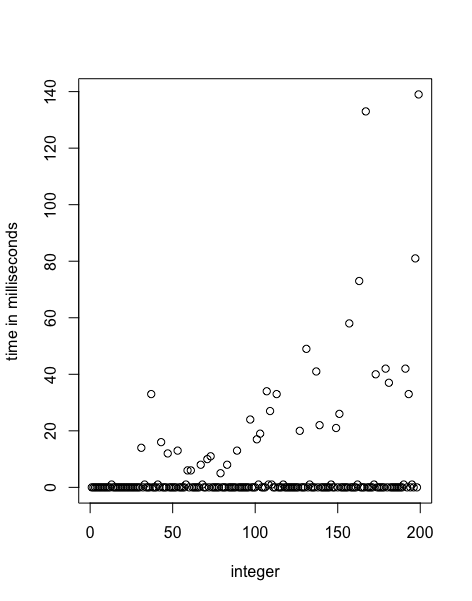

### Viikkoraportti 6

Kuudennella ohjelmointiviikolla sain valmiiksi varsinaisen päätehtäväni, eli toimivan
AKS-algoritmin toteutuksen. Jouduin tätä varten toteuttamaan Polynomi-luokalle
modulaarista eksponentiaatiota suorittavan metodin, sillä olin aikaisemmin törmännyt
ongelmiin suurista potenssiin korotuksista seuranneiden ylivuotojen kanssa. Modulaarisen
eksponentiaation kanssa ylivuoto-ongelmat korjaantuivat, sillä Polynomeille ei
modulo huomioon ottaen tullut yhtä suuria kertoimia kuin aikaisemmin, eivätkä kertoimille
varatut coefficients-listan paikat vuotaneet yli ja aiheuttaneet päävaivaa.

Toteuttamani AKS-algoritmi toimii tällä hetkellä oikein ja osaa jaotella annetun luvun
alkulukuihin tai yhdistettyihin lukuihin. Törmäsin kuitenkin algorimin käytön kannalta vakavaan ongelmaan:
se on toteutustasolla älyttömän hidas tarkistamaan alkuluvusta, onko se todella alkuluku.
Tämä näkyy selvästi kuvaajasta, jossa kokonaisluvut ja niiden alkulukuisuuden määrittämiseen
käytetty aika (ms.) on kuvattu vastakkain. .

Uskon ongelman johtuvan siitä, että algorimin viidennessä pääkohdassa joudun käyttämään
paljon ja suurikertoimisia Polynomi-luokan olioita, jotka itsessään ovat ajallisesti
raskaita käsitellä ja joille määritellyt metodit käyttävät tekemäni kaltaisilla naiveilla
toteutuksilla paljon aikaa. Algoritmin viides vaihe ajetaan loppuun vain siinä tapauksessa,
että tarkastelun kohteena oleva luku on alkuluku, joten jotkut alkuluvut ja niiden tarkistaminen
vievät aivan liikaa aikaa siihen nähden, että halusin toteuttaa nopean algoritmin alkulukujen
tarkistamiseen. Sen sijaan yhdistetyt luvut algoritmi tarkastaa todella nopeasti.

Sain myös aloitettua käyttöliittymän tekemisen demotilaisuutta varten. Se on vielä nyt
hieman buginen ja hankalakäyttöinen, mutta koitan saada sen valmiiksi keskiviikkoon mennessä.
Käyttöliittymä tulee olemaan (näillä näkymin) yksinkertainen komentorivikäyttöliittymä, sillä
ohjelmistoni tekee vain yhtä, helposti komentorivin kautta käsiteltävää tehtävää.

Käytin tällä viikolla projektin tekemiseen arviolta 8 tuntia.
